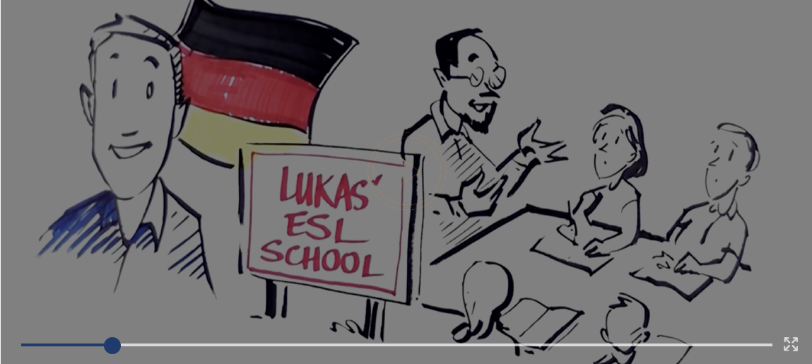

{}

## Language Lessons Online

## with _YOUR_ students and _OUR_ teachers

**White-label** Online Language Tutoring Platform **for Language Schools, Higher Education and Companies.**

{}

{}

{}

# White-label Teaching Staff

{}

Get instant access to a team of certified native English speaking teachers  
working on behalf of your school

{}

{}

{}

# Academic Content

{}

Get instant access to a full library of language courses.

{}

{}

{}

# Software

{}

All in one place! No other software needed

{}
{}
{}
{}
{}
{}

{}

{}

{}

# Zamenhof, Explained In Three Minutes

{}

{}

{}

{}

# Grow Your Online Business Today

{}
